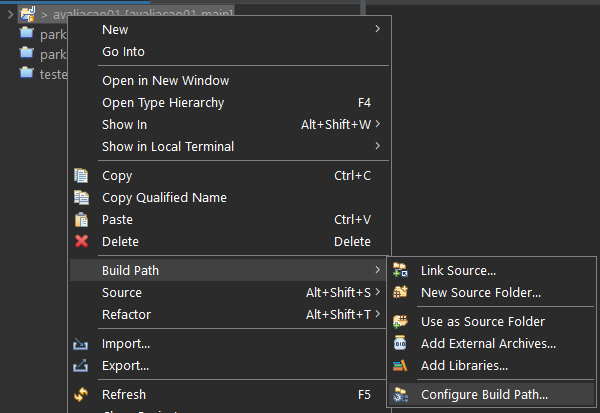
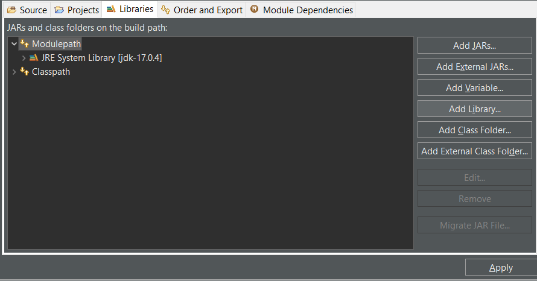
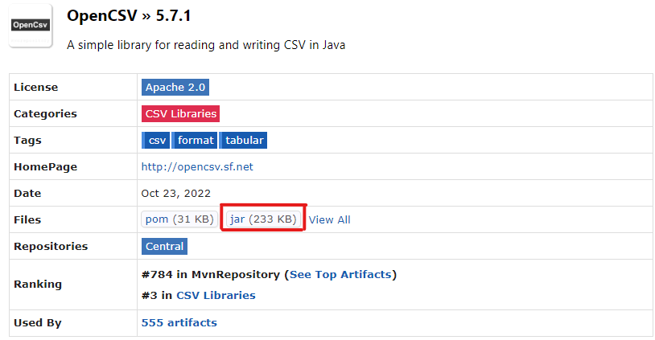
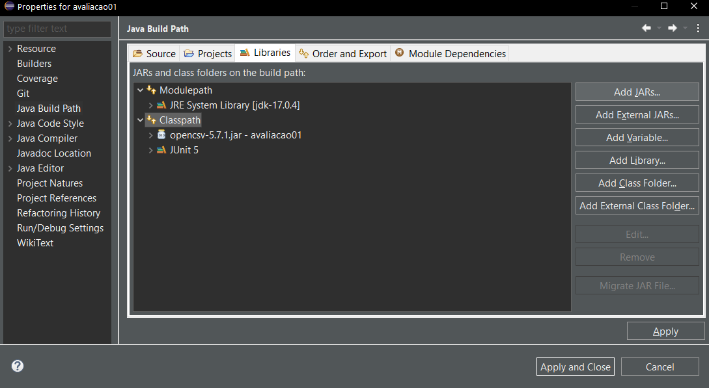
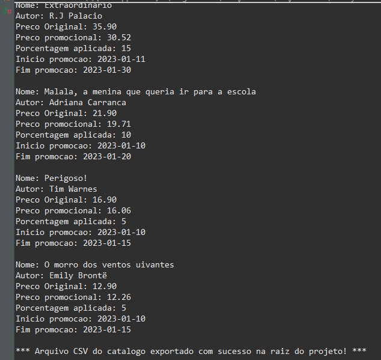
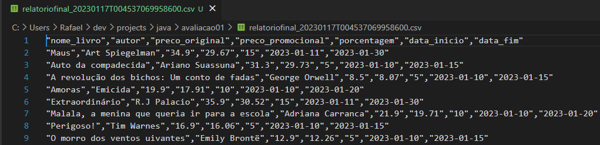

# avaliacao01

## Começando

Para a execução do código, será necessário instalar os seguintes programas:

- [JDK 17: Necessário para executar o projeto](https://www.oracle.com/java/technologies/javase/jdk17-archive-downloads.html)
- [Eclipse IDE for Java Developers: Para o desenvolvimento do projeto](https://www.eclipse.org/downloads/packages/)

Ao baixar o projeto, é possível que aconteça um erro relacionado ao path do JRE. Neste caso, será necessário remover a library do JRE, e incluir novamente para atualizar o path, isto pode ser feito em `Botão direito no projeto > Build Path > Configure Build Path > ModulePath > Add Libray`.

Para a geração de um arquivo csv utilizou-se o [OpenCSV](https://mvnrepository.com/artifact/com.opencsv/opencsv/5.7.1), sendo necessário baixar o arquivo JAR e incluir na raiz do projeto.

Caso o OpenCSV não seja reconhecido no projeto, será necessário adicioná-lo ao classpath em `Botão direito no projeto > Build Path > Configure Build Path > ClassPath > Add Jars`.

## Relatório Final via console

## Relatório Final em CSV

